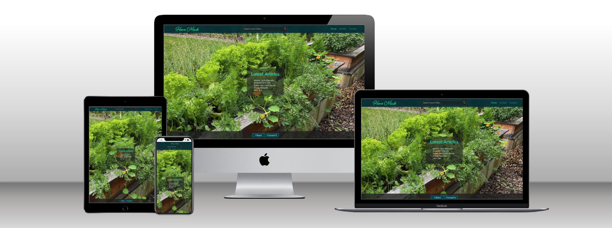
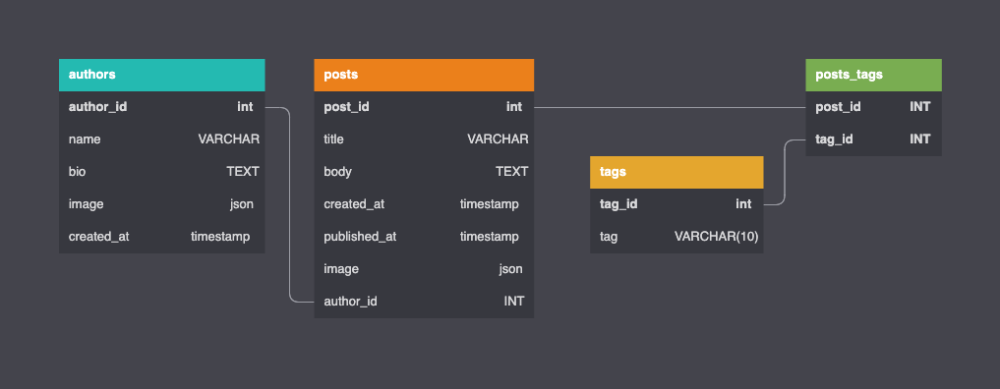

# Homemade Server API for Homemade App

This project is specifically to serve data to the [Homemade React App](https://github.com/daidensacha/home-made).

Live site [can be viewed here](https://dapper-choux-f34d8d.netlify.app/article/4CRFPqHd7onCDbs41MvHRD), hosted on Netlify.

The project is a part of an introduction to React, Node JS, Express JS, and PostgreSQL and setting up an API.

### PostgreSQL Schema ERD



**Create Tables as follows.**

```sql
CREATE TABLE "authors" (
  "author_id" SERIAL PRIMARY KEY,
  "name" VARCHAR,
  "bio" TEXT,
  "image" json, -- insert image url and title as json
  "created_at" timestamp
);

CREATE TABLE "posts" (
  "post_id" SERIAL PRIMARY KEY,
  "title" VARCHAR,
  "body" TEXT,
  "created_at" timestamp,
  "published_at" timestamp,
  "image" json, -- insert image url and title as json
  "author_id" INT,
  CONSTRAINT fk_author FOREIGN KEY ("author_id") REFERENCES "authors" ("author_id")
);

CREATE TABLE "tags" (
  "tag_id" SERIAL PRIMARY KEY,
  "tag" VARCHAR(10)
);

CREATE TABLE "posts_tags" (
  "post_id" INT,
  "tag_id" INT,
  PRIMARY KEY ("post_id", "tag_id"),
  CONSTRAINT fk_tag FOREIGN KEY ("tag_id") REFERENCES "tags" ("tag_id"),
  CONSTRAINT fk_post FOREIGN KEY ("post_id") REFERENCES "posts" ("post_id")
```

Note the image field in posts and authors is of type json. The url and image are inserted as follows.

```json
{"url":"https://images.url",
    "title":"image-title"}
```

### Added NPM Dependencies

```json
"cors": "^2.8.5",
"dotenv": "^16.0.1",
"express": "^4.18.1",
"express-promise-router": "^4.1.1",
"nodemon": "^2.0.19",
"pg": "^8.7.3"
```
